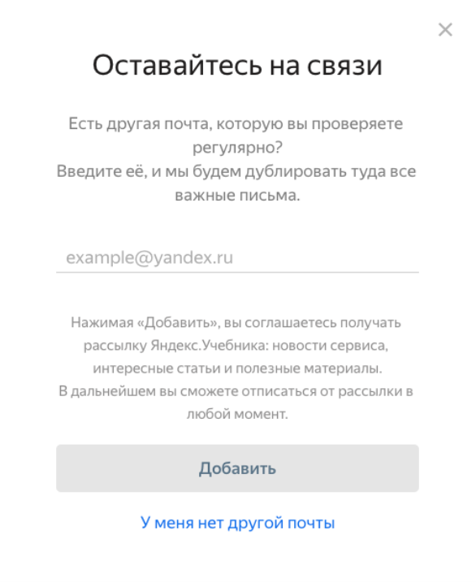
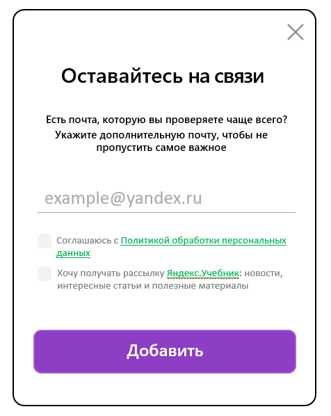

# Содержание
1. [Группировка профилей](#1-группировка-профилей)
2. [Интерфейс Яндекс.Учебника](#2-интерфейс-яндексучебника)
3. [Практическое задание с curl](#3-практическое-задание-с-curl)

---

# 1. Группировка профилей

Посмотрите статью «Группировка профилей» https://yastatic.net/s3/doc-binary/common/hire/peoplesearch-grouping-guide.pdf из Справки сервиса «Поиск по людям». Это бывший сервис Яндекса, который помогал находить профили людей в социальных сетях, размещенные в открытом доступе. 
Подумайте, как можно улучшить эту статью, и предложите свой отредактированный вариант документа. Изменить можно всё: структуру, оформление, тексты, содержание.

## Решение

Статья по группировке профилей была переработана в инструкцию по объединению аккаунтов. Хотелось показать как бы это работало сейчас. Содержание приближено к новым реалиям, рассмотрены варианты объединения аккаунтов и привязка внешних аккаунтов к Яндекс ID. В новой статье более четко определены цели действия, описана выгода использования единого аккаунта Яндекс.

[Статья в формате Markdown](./first_task.md)

# 2. Интерфейс Яндекс.Учебника

Отредактируйте текст интерфейса Яндекс.Учебника. Пользователи получают письма на почту, привязанную к аккаунту Учебника. Но зачастую они не проверяют эту почту регулярно, потому что используют аккаунт только для регистрации. В такой ситуации сервис предлагает получать рассылку на другой ящик.
Расскажите, какие недочеты вы видите в текущем варианте, и предложите свой вариант текста и оформления. Расположение элементов интерфейса можно менять. 



## Решение 

В исходном варианте были выялены следующие недочеты:

1.	Много текста между призывом **Оставайтесь на связи** и кнопкой **Добавить**, из-за чего основная цель действия теряется.

2.	Фраза «дублировать» вызывает негативную ассоциацию у пользователя «еще больше навязчивых рассылок».

3.	Элемент **У меня нет другой почты** выделяется активнее кнопки **Добавить** и смещает фокус с целевого действия.

4.	Отказ от действия для пользователя более интуитивен и комфортен через кнопку закрытия формы, чем через отдельный текстовый элемент **У меня нет другой почты**.

5. Не предусмотрен чекбокс для подтверждения согласия на рассылку.

6. Не предусмотрен чекбокс для подтверждения согласия с правилами обработки данных.

Для нового варианта были внесены следующие изменения:

1. Текст сокращён и сфокусирован на ключевой ценности действия.

2. Добавлены чекбоксы для управления подпиской и подтверждения согласия на обработку данных.

3. Удален элемент **У меня нет другой почты** как избыточный.

4. Усилена визуально кнопка **Добавить**.



---

# 3. Практическое задание с curl

Отправьте запрос к API и приложите ответ. Задание вы можете найти по ссылке https://yastatic.net/s3/doc-binary/common/hire/curl-dictionary.docx. 
Приложите текст вашего запроса и прикрепите XML-файл с полученным ответом.

## Решение

### Запрос curl

```bash
curl https://dictionary.yandex.net/api/v1/dicservice/lookup -G \
    -d key={MY_API_KEY} \
    -d lang=en-ru \
    -d text=sky \
    -d ui=ru
```

---

### XML-ответ с curl

```bash
<?xml version="1.0" encoding="utf-8"?>
<DicResult nmt_code="200" code="200"><head /><def pos="существительное" ts="skaɪ"><text>sky</text><tr pos="существительное" gen="ср" fr="10"><text>небо</text><syn pos="существительное" fr="5"><text>небеса</text></syn><syn pos="существительное" gen="ср" fr="1"><text>поднебесье</text></syn><mean><text>heaven</text></mean><mean><text>heavens</text></mean></tr><tr pos="существительное" gen="м" fr="1"><text>небосвод</text><syn pos="существительное" gen="м" fr="1"><text>небосклон</text></syn><syn pos="существительное" fr="1"><text>небесный свод</text></syn><mean><text>firmament</text></mean><mean><text>horizon</text></mean></tr><tr pos="существительное" gen="м" fr="5"><text>Скай</text></tr></def><def pos="прилагательное" ts="skaɪ"><text>sky</text><tr pos="прилагательное" fr="5"><text>небесный</text><mean><text>heavenly</text></mean></tr></def></DicResult>
```

### Запрос в браузере

Браузер выполняет HTTP GET запрос при подстановке в адресную строку, результат аналогичен curl:

```
https://dictionary.yandex.net/api/v1/dicservice/lookup?key={MY_API_KEY}&lang=en-ru&text=sky&ui=ru
```

--- 

### XML-ответ в браузер

```xml
<?xml
version="1.0" encoding="utf-8"?>
<DicResult nmt_code="200" code="200">
    <head/>
    <def pos="существительное" ts="skaɪ">
        <text>sky</text>
        <tr pos="существительное" gen="ср" fr="10">
            <text>небо</text>
            <syn pos="существительное" fr="5">
                <text>небеса</text>
            </syn>
            <syn pos="существительное" gen="ср" fr="1">
                <text>поднебесье</text>
            </syn>
            <mean>
                <text>heaven</text>
            </mean>
            <mean>
                <text>heavens</text>
            </mean>
        </tr>
        <tr pos="существительное" gen="м" fr="1">
            <text>небосвод</text>
            <syn pos="существительное" gen="м" fr="1">
                <text>небосклон</text>
            </syn>
            <syn pos="существительное" fr="1">
                <text>небесный свод</text>
            </syn>
            <mean>
                <text>firmament</text>
            </mean>
            <mean>
                <text>horizon</text>
            </mean>
        </tr>
        <tr pos="существительное" gen="м" fr="5">
            <text>Скай</text>
        </tr>
    </def>
    <def pos="прилагательное" ts="skaɪ">
        <text>sky</text>
        <tr pos="прилагательное" fr="5">
            <text>небесный</text>
            <mean>
                <text>heavenly</text>
            </mean>
        </tr>
    </def>
</DicResult>
```

--- 

